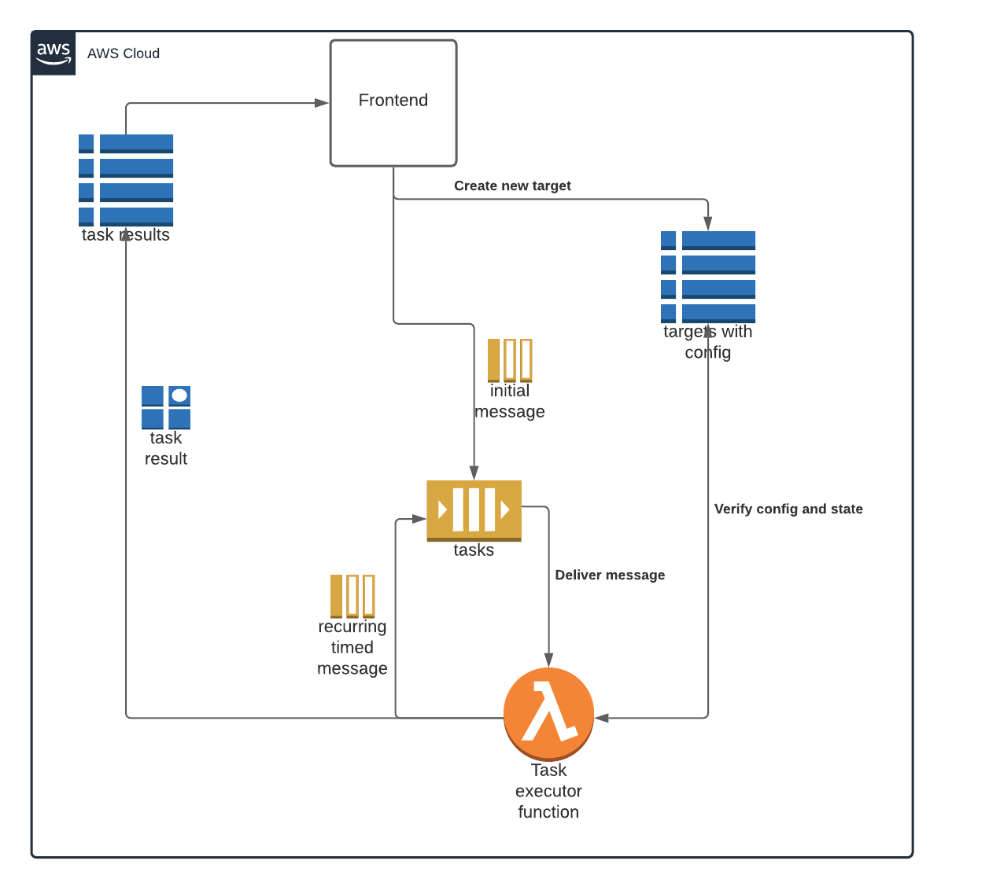

# simple-task-executor
This is basically a simple project I did over the Christmas break in 2020/2021.
The idea is to play around with a simple SQS, Lambda and DynamoDB setup using the [Serverless framework](https://www.serverless.com/).
The small system is meant to be used to execute lambda functions on a timed interval using delayed SQS messages. A Target has a type that defines which function to run. Each function returns some output data which is then saved.
At the end of the function a new delayed message is then added to the SQS queue for the next execution.
This setup works fine for smaller intervals since the max delay on an SQS message is 900 seconds (15 minutes). For tasks with a larger delay something like step functions could maybe be used.

I chose to do it in both Golang and Node.js just for the fun of it.

## Disclaimer
If you have a lot of stuff you want to keep and eye on and execute functions for then this setup of course is not optimal in terms of pricing.
However, it is a fairly simple and func way to do it - it also beats the price for external services if you don't need a lot of stuff running or if you want an easy way to do custom stuff.

---

## Setup
The overall setup looks like this:

I didn't do the frontend since that would take time away from the fun part of it.

### Dynamodb
The setup consists of two Dynamodb tables: `Targets` and `TargetTaskResults`.

`Targets` holds information about the different targets, their type, config for the executor function and so on.
`TargetTaskResults` holds information about the results for each task execution. If the task execution function return null or nil then the result is not saved.

### SQS
`TargetTasksQueue` holds the delayed massages for future task executions.

### Lambda
`taskHandler` is the primary function for handling tasks.

## Testing
Since I haven't created any frontend for it the testing is done manually by first creating the target in the dynamoDB table `Targets` and then pushing a message to the SQS queue `TargetTasksQueue`.

### Step 1
Create targets in `Targets` from one of the files in `/demo/targets/`. If `active` is not `true` then the `taskHandler` function will abort and will not schedule more delayed messages.

### Step 2
Publish the first message to SQS queue `TargetTasksQueue`. The message body is not used right now only the message attribute `TargetId` is used with the id of the target that should be executed.
The config is then fetched based on the target id. It means a bit more activity on the dynamodb table `Targets` but it also means a simple way of stopping running tasks.